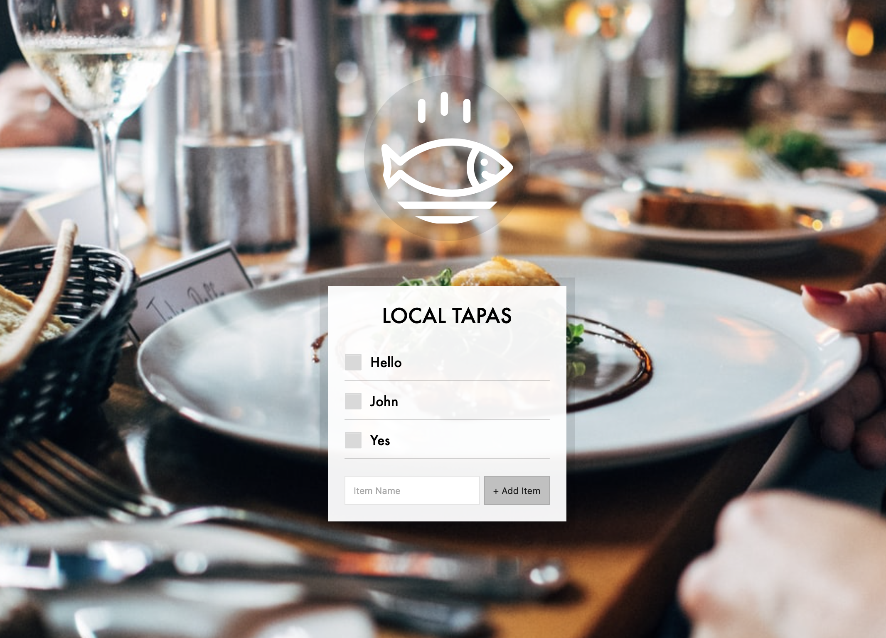
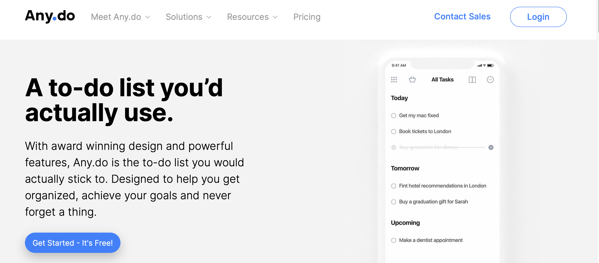
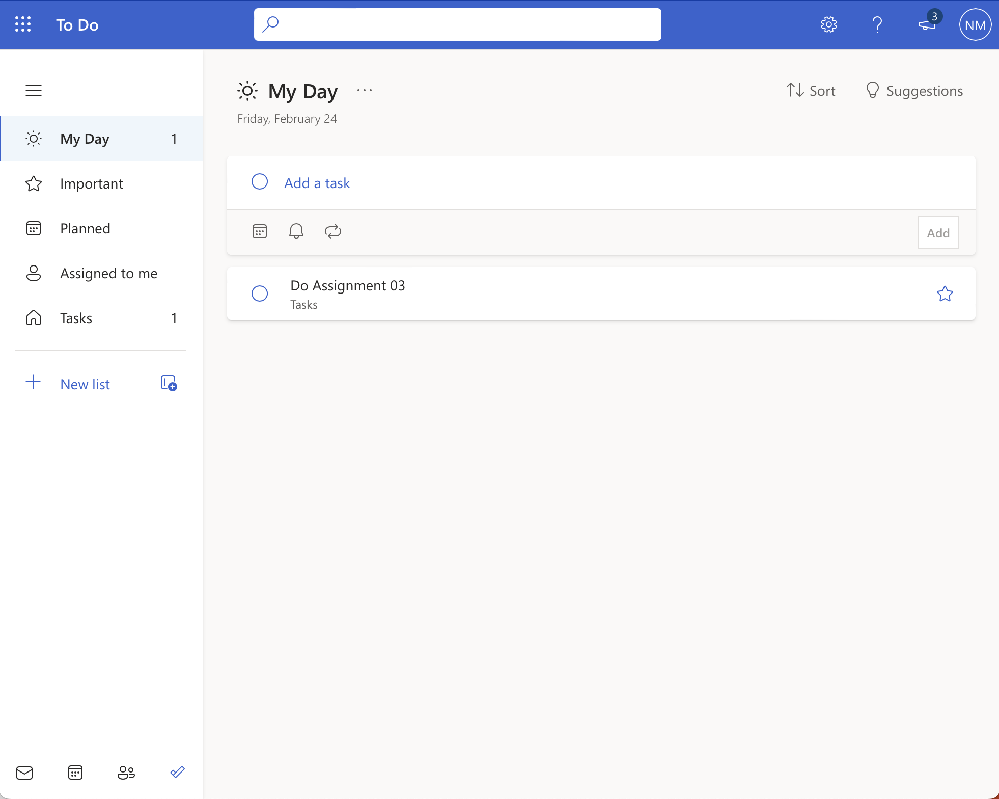
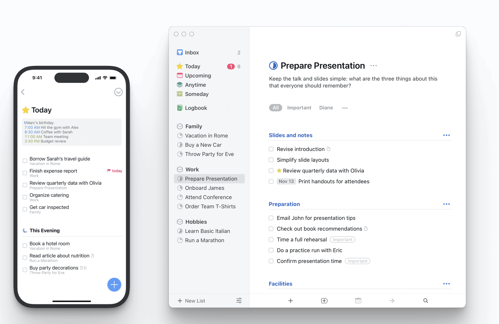

# Assignment 04

**Course Title**: Web Development

**Course Code**: IRM1005 / ITEC1005

**Semester**: Fall 2023

**Due Date**: 11:59 PM on November 26, 2023

**Assessment**: This assignment is worth 15% of your final grade and marked out of 100.

## TLDR

1. Build a Todo list wep app.
2. Conduct a code review on a team members assignment 04 submission.
3. Commit your code to your assignment repository in GitHub.
4. Turn on GitHub Pages in your repository to host your web page online.

## Description

Todo lists are like a "right of passage" in webdev tutorials. A simple Todo list can be written in a couple dozen lines of code. There is, however, a huge opportunity for innovation, enhancements and features that can take this project from a learning opportunity to a showcase you put on a portfolio. 

Your Assignment 04 involves building and shipping an awesome and innovative Todo list app, as well as doing a basic code review on a team member's submission.

Students will also be assessed on their ability to commit their code to GitHub and activate the GitHub pages service.

## Table of contents

- [Instructions for the app](#instructions-for-the-app)
- [Instructions for the code review](#instructions-for-the-code-review)
- [Screenshots for inspiration](#screenshots-for-inspiration) 
- [Acceptance criteria](#assignment-acceptance-criteria)
- [Grading rubric](#grading-rubric)
- [Checklist](#checklist)
- [FAQ](#frequently-asked-questions-faq)
- [Helpful Links](#helpful-links)

## Instructions for the app 

1. Use HTML, CSS, and JS to build a basic Todo List web app.
2. The UI/UX is completely up to you, though it must be responsive and at a minimum enable users to view, add, mark as done, and delete `todos`. 
3. Using user centered design principles, consider what additional properties and features your users may need for an awesome Todo list. 
4. Your `todos` are going to have, at a minimum, an `id`, `text` and `completed` status.
5. You should also have an awesome empty state when a user first opens your app ([examples](https://www.toptal.com/designers/ux/empty-state-ux-design)).  
6. Though not required, consider "branding" your app with a cool product name, and logo. 

## Instructions for the code review

It is your responsibility to both request a code review from your team members and to conduct a code review for one of your team members.

### Request code review 

1. When you are between 50% - 100% completed your assignment 04, inform your team members that you require a code review. Post a message in our [GitHub Discussion group if you need a code review](https://github.com/orgs/irm1005-itec1005-fall-2023/discussions/15).

### Conduct code review 

1. Work with your team members to identify when someone requests a code review 
2. Create a GitHub Issue in your team members assignment  repository to record the results of the following checks 
3. Check to see that their HTML code validates using the [WC3 HTML Validator](https://validator.w3.org)
4. Check to see that their CSS code validates using the [W3C CSS Validator](https://jigsaw.w3.org/css-validator/)
5. Check to see that basic functionality is working in their web app (add todo, delete todo, mark as done)

## Screenshots for inspiration 

The following are some samples of excellent Todo List applications out there. You do not, and should not build these specfic designs. This is only being shared to illustrate what the industry is putting out there right now, and to provide some inspiration for your own designs and features.

### Super Simple Todo List App 

[Source](https://github.com/wesbos/JavaScript30)

### Simple Todo List App

[Source](https://www.uplabs.com/posts/simple-todo-list-app)

### Any.do App

[Source](https://www.any.do/to-do-list/)

### Microsoft To do

[Source](https://todo.microsoft.com)

### Things by Cultured Code

[Source](https://culturedcode.com/things/)

## Assignment acceptance criteria 

* Publish your code to GitHub using the GitHub classrooms generated repository
* Use the GitHub Pages service to host your pages
* GitHub time stamps on your project files will be used to asses when the assignment was submitted
* Ensure you have a license file in your repository (recommend MIT license)

## Grading rubric

The creation and posting of this web app is worth 15% of your final grade and marked out of 100.

|Criteria|Total&nbsp;Marks|How we define excellence|
|----|----|----|
|Visual design and layout|**10%**|The design presented demonstrates an excellent use of colour (or lack thereof), typography, high quality graphics, and iconography. The design also comes across as cohesive, inviting, and illustrates a focus on user experience. An excellent design also includes a way of delighting users and adding moments of charm to their experience. The solution is responsive to the users' viewport and displays well in mobile, tablet, and desktop browsers.|
|Overall Code Quality|**10%**|The HTML, CSS, and JS Code is well formed, structured, and compliant. Approriate semantic elements and heading structure are used. No run time errors occur. CSS is stored in a seperate file and the `style` tag as well as inline styles are avoided.|
|Add to do |**10%**|Ability to add a to do item|
|Delete to do|**15%**|Ability to delete a to do item|
|Mark a to do as done|**15%**|Ability to mark a todo item as completed|
|Moments of charm|**10%**|App adds something special such as annimations, transitions, categories, or anything else that elevates the user experience from "normal" to "awesome".|
|Code&nbsp;review|**20%**|Perform a code review on a team members assignment submission and record the results within a GitHub issue in a team members assignment repository.|
|GitHub&nbsp;submission|**10%**|All of the project files (HTML, CSS, JS, assets) are added to your assignment repository on GitHub. The repository has both a populated READMe.md file and a MIT license file.|

## Late submissions

- If you are ill or any other issues arise that are beyond your control, please email [neil.mispelaar@carleton.ca](mailto:neil.mispelaar@carleton.ca) before the specified due date to request a one week extention.
- If you fail to obtain an extentaion or fail to inform the instructor of any extenuating circumstances that cause a delay in your submission by the posted due date, you will receive a mark of **Zero (0)** for the assignment.

## Checklist

To help with your submission, make sure that you have reviewed the following items

- [x] Your app has the minimum functionality required for a basic Todo List App (add, delete, mark as done)
- [x] Your code is committed and pushed to the GitHub repo that GitHub Classrooms created for you
- [x] You have conducted a code review on one of your team members assignments
- [x] One of your team members have conducted a code review on your assignment
- [x] [GitHub Pages](https://github.com/orgs/irm1005-itec1005-fall-2023/discussions/4) is activated for your repo and your web page is live and accessible. If you are unsure, send your link to a team member and see if they can access your site from their machine.

## Frequently Asked Questions (FAQ)

<dl>
  
  <dt>Do I have to put comments in my code?</dt>
  <dd>No! You do not need to comment your code. That being said, it is an industry best practice to add comments to your code, so I would recommend that you add comments to your code where it makes sense, but this is not required.</dd>
  
  <dt>Does the web page / web app have to work in both mobile and desktop?</dt>
  <dd>Yes! You must build your app to be completely responsive.</dd>
 
  <dt>Can I use lorem ipsum text in my web page / web app?</dt>
  <dd>You may use lorem ipsum if you need to but ideally by now you should be using relevant content in your projects. Though, if you don't have relevant content you are absolutely permitted to use <a href="https://www.lipsum.com">lorem ipsum</a>, <a href="https://baconipsum.com">bacon ipsum</a>, or <a href="https://veganipsum.me">vegan ipsum</a> in your designs. Keep in mind that this should not be used in cases where the meaning of the text is important, for example the call to action buttons in the hero.</dd>

  <dt>Do I need to include sketches, concepts, or initial low fidelity mockups in my submission?</dt>
  <dd>No. If you would like to share your design or creative process I'm happy to look at them, but it is not required.</dd>
 
  <dt>Can I use trademarked or copywritten material on my page?</dt>
  <dd>Yes! As this is for educational purposes, all of the source is open, and no one is trying to sell their design or code you can absolutely use trademarked or copywritten material.</dd>
 
</dl>

## Helpful links

### HTML Resources

* [Intro to HTML - Prof3ssorSt3v3](https://www.youtube.com/watch?v=KUmuiqV1xME&list=PLyuRouwmQCjncCz8JChyPNRBvm2ONGYa2)
* [HTML Tutorial - MDN](https://developer.mozilla.org/en-US/docs/Learn/HTML)

### CSS Resources 

* [Intro to CSS - Prof3ssorSt3v3](https://www.youtube.com/watch?v=KFKScNHa-8M&list=PLyuRouwmQCjl4wTSNbb8RTKZuyMhoIxBe&index=2)
* [CSS Tutorials - MDN](https://developer.mozilla.org/en-US/docs/Web/CSS/Tutorials)

### JavaScript Resources

* [Learn JavaScript - MDN](https://developer.mozilla.org/en-US/docs/Learn)
* [The Modern JavaScript Tutorial](https://javascript.info)
* [LearnJS.org](https://www.learn-js.org)

### Images and Icons 

* [Pexels](https://www.pexels.com)
* [Unsplash](https://unsplash.com)
* [The noun project](https://thenounproject.com)

### Inspiration 

* [Article on Guerrilla User Testing](https://xd.adobe.com/ideas/process/user-testing/hallway-usability-test-guerrilla-testing/)
* [Land Book](https://land-book.com)
* [Best Website Gallery](https://bestwebsite.gallery/sites)
* [One page love](https://onepagelove.com)
* [Awwwards](https://www.awwwards.com/websites/)
* [ui8.net](https://www.ui8.net)
